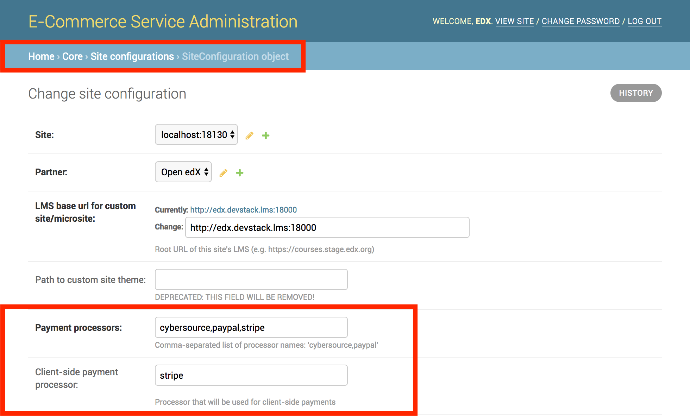

Payment Processors
##################

.. warning:: As of 8/2019, with the introduction of the Payment microfrontend (MFE), the payment processors can no longer be enabled or disabled for the frontend as documented below. At this time, CyberSource, Paypal, and Apple Pay processing is baked into the Payment MFE.

Payment processors/gateways handle the acceptance/validation of payment data--credit cards, wallet payments, etc.--and
transfer of funds from learners to merchants. At edx.org, we use CyberSource to accept credit card payments, and PayPal
to accept PayPal payments (made from either the learner's PayPal account, bank account, or credit card). The codebase
also contains an integration for Stripe, which supports credit card payments amongst other payment methods.

If you are interested in supporting another payment processor, reach out to the open source community to determine if
someone has already developed an integration. Otherwise, you may refer to existing integrations as reference points.

All processor secrets are configured via the ``PAYMENT_PROCESSOR_CONFIG`` setting. This is a `dict` that maps partner
short codes to another dict that maps processor names to configuration. These settings are for each site/tenant. In
order to make use of a processor, the processor needs to be activated via the Site Configuration Django admin form.
Finally, there are Waffle flags that can be used to disable payment processors for all tenants in the event of an outage.

.. note::

    The payment processor settings below will be displayed as if they were defined in a Python settings file. Ideally,
    you should use the Ansible plays in edx/configuration to generate the settings, however that may not feasible for
    those using pre-built systems such as the EC2 images from Bitnami and other providers.

Enabling Payment Processors
***************************
Payment processors must be enabled globally and individually for each site/tenant hosted by your installation. At the
global level, you must specify the Python classes that will be used to process transactions for your processors. Each of
these classes should inherit from `BasePaymentProcessor <https://github.com/openedx/ecommerce/blob/7555353ae972563fd293558eea608ae6151c1186/ecommerce/extensions/payment/processors/__init__.py#L20>`__.

.. code-block:: python

    PAYMENT_PROCESSORS = (
        'ecommerce.extensions.payment.processors.cybersource.CybersourceREST',
        'ecommerce.extensions.payment.processors.paypal.Paypal',
        'ecommerce.extensions.payment.processors.stripe.Stripe',
    )

The secret keys and additional configuration must be specified for each site. The keys of the
``PAYMENT_PROCESSOR_CONFIG`` dict correspond to the ``short_code`` field value on the ``Partner`` model linked to each
site.

.. code-block:: python

   PAYMENT_PROCESSOR_CONFIG = {
       'edx': {
           'cybersource-rest': {
               ...
           },
           'paypal': {
               ...
           },
           'stripe': {
               ...
           },
       },
       'mitxpro': {
           'cybersource-rest': {
               ...
           },
           'paypal': {
               ...
           },
           'stripe': {
               ...
           },
       },
   }

Finally, the payment processors must be activated for each site via Django admin. The **Payment processors** field
should contain a comma-separated list of payment processor names. These names correspond to the ``NAME`` property of the
Python classes.

If you are using the checkout page hosted in the E-Commerce Service (e.g. client-side checkout), you must also specify
the name of the processor to be used for processing credit card transactions. Note that PayPal *cannot* be used for
these types of payments.

Disabling Payment Processors
****************************
Payment processors sometimes experience temporary outages. When these outages occur, you can use Waffle switches to
disable the faulty payment processor or processors, then re-enable them after the outage is over.

The names of these switches use prefixes that are the value of the ``PAYMENT_PROCESSOR_SWITCH_PREFIX`` setting. By
default, this value is ``payment_processor_active_``. The following table lists valid switches and the payment
processors they control.

.. list-table::
   :header-rows: 1

   * - Payment Processor
     - Switch Name
     - Default Value
   * - PayPal
     - payment_processor_active_paypal
     - True
   * - CyberSource
     - payment_processor_active_cybersource-rest
     - True
   * - Stripe
     - payment_processor_active_stripe
     - True

In the unlikely event that all payment processors are disabled, the LMS will display an informative error message
explaining why payment is not currently possible.

Apple Pay
*********

.. warning:: Apple Pay has been unsupported since 9/2019.

Apple Pay allows learners to checkout quickly without having to manually fill out the payment form. If you are not
familiar with Apple Pay, please take a moment to read the following documents to understand the user flow and necessary
configuration. **Apple Pay support is only available when using either the CyberSource or Stripe processors.**

* `Apple Pay JS <https://developer.apple.com/documentation/applepayjs>`_
* `CyberSource: Apple Pay Using  the Simple Order API <https://www.cybersource.com/developers/integration_methods/apple_pay/>`_
* `Stripe: Apple Pay on web <https://stripe.com/apple-pay>`_

Apple Pay is only available to learners using Safari on the following platforms:

* iOS 10+ on devices with a Secure Element
* macOS 10.12+. The user must have an iPhone, Apple Watch, or a MacBook Pro with Touch ID that can authorize the
  payment.

An exhaustive list of devices that support Apple Pay is available on
`Wikipedia <https://en.wikipedia.org/wiki/Apple_Pay>`_.

.. note::

    The Apple Pay button is not displayed to users with incompatible hardware and software.

Testing
-------
Apple Pay is only available over HTTPS (SSL). If you do not have SSL configured for your local development system, use a
tunnel/proxy application like `ngrok`_ to expose your system via publicly-accessible URL with HTTPS. Additionally, when
testing with CyberSource, you will need to validate your ngrok domain at Apple.

CyberSource
***********
Our CyberSource integration supports using the `Flex Microform API`_ for accepting payments.

In addition to Secure Acceptance, this processor plugin also makes use of the Simple Order API to facilitate payments
made via Apple Pay and refunds (for all payment methods).

When testing payments with your test profiles, use test card numbers from https://www.cybersource.com/developers/other_resources/quick_references/test_cc_numbers/.

.. _Flex Microform API: https://developer.cybersource.com/api/developer-guides/dita-flex/SAFlexibleToken/FlexMicroform.html

Settings
--------
Note that "EBC" below refers to the Business Center accessible at one of the two URLs below, depending on the
environment in which you are operating.

* Test: https://ebctest.cybersource.com/ebctest/login/Login.do
* Production: https://ebc.cybersource.com/ebc/login/Login.do

.. code-block:: python

    # PAYMENT_PROCESSOR_CANCEL_PATH and PAYMENT_PROCESSOR_ERROR_PATH should come from here
    from ecommerce.settings.production import *

    PAYMENT_PROCESSOR_CONFIG = {
        'edx': {
            'cybersource-rest': {
                # This is the merchant ID assigned by CyberSource
                'merchant_id': '',

                # Generate this at EBC: Account Management > Transaction Security Keys > SOAP Toolkit API
                'transaction_key': '',

                # Production: https://ics2wsa.ic3.com/commerce/1.x/transactionProcessor/CyberSourceTransaction_1.166.wsdl
                'soap_api_url': 'https://ics2wstest.ic3.com/commerce/1.x/transactionProcessor/CyberSourceTransaction_1.166.wsdl',

                # Use the default value in settings/base.py or Ansible
                'cancel_checkout_path': PAYMENT_PROCESSOR_CANCEL_PATH,

                # This instructs the plugin to send Level II/III details. Consider disabling if you run into issues.
                'send_level_2_3_details': True,

                # These come from the Apple Developer portal
                # https://developer.apple.com/account/ios/identifier/merchant
                'apple_pay_merchant_identifier': '',
                'apple_pay_merchant_id_domain_association': '',

                # Two-letter ISO 3166 country code for your business/merchant account
                # https://en.wikipedia.org/wiki/ISO_3166-1_alpha-2
                'apple_pay_country_code': '',

                # Filesystem path to the merchant identity certificate (used to authenticate with Apple to start
                # sessions). This file should be kept in a secure location that is only accessible by administrators
                # and the application' service user.
                'apple_pay_merchant_id_certificate_path': '',
            },
        },
    }

PayPal
******
The PayPal integration redirects learners to a PayPal checkout page where they can pay with a PayPal balance, bank
transfer, or credit card. Regardless of how the learner pays, the work done by the E-Commerce Service is the same. In
fact, the service doesn't even know the payment method.

Settings
--------

.. code-block:: python

    # PAYMENT_PROCESSOR_CANCEL_PATH and PAYMENT_PROCESSOR_ERROR_PATH should come from here
    from ecommerce.settings.production import *

    PAYMENT_PROCESSOR_CONFIG = {
        'edx': {
            'paypal': {
                # Change this to 'live' in production
                'mode': 'sandbox',

                # These credentials come from PayPal at https://developer.paypal.com/.
                'client_id': '',
                'client_secret': '',

                # Use the default value in settings/base.py or Ansible
                'cancel_checkout_path': PAYMENT_PROCESSOR_CANCEL_PATH,
                'error_path': PAYMENT_PROCESSOR_ERROR_PATH,
            },
        },
    }

Stripe
******
The Stripe integration supports payments via credit cards. Sensitive data--credit card number, card expiration date, CVC--never touches your servers. Instead this information is relayed directly to Stripe in exchange for a token, which Stripe calls a `Payment Intent`_. This token is sent to the E-Commerce Service and used to make a final call to Stripe, charging the learner and completing the checkout process.

The E-Commerce Service uses `Stripe Custom Actions`_ to send payments through a backend before payment. Ask your Stripe representative to enable this feature on your account. For more information, see `frontend-app-payment ADR-5`_.

To set up Ecommerce to use Stripe in frontend-app-payment, enable waffle flag ``enable_stripe_payment_processor``.

To migrate from Cybersource to Stripe, see the example use case of the `frontend-app-payment feature toggle HOWTO`_.

.. _Payment Intent: https://stripe.com/docs/payments/payment-intents
.. _Stripe Custom Actions: https://stripe.com/docs/payments/run-custom-actions-before-confirmation
.. _frontend-app-payment ADR-5: https://github.com/openedx/frontend-app-payment/blob/master/docs/decisions/0005-stripe-custom-actions.rst
.. _frontend-app-payment feature toggle HOWTO: https://github.com/openedx/frontend-app-payment/blob/master/docs/how_tos/feature_toggle.rst#what-is-an-example-use-case

Settings
--------

.. code-block:: python

    PAYMENT_PROCESSOR_CONFIG = {
        'edx': {
            'stripe': {
                # Stripe API version to use.
                'api_version': '',
                # Send anonymous latency metrics to Stripe.
                'enable_telemetry': '',
                # Stripe client logging level. None will default to INFO.
                'log_level': '',
                # How many times to automatically retry requests. None means no retries.
                'max_network_retries': '',
                # Send requests somewhere else instead of Stripe. May be useful for testing.
                'proxy': '',
                # Get your keys from https://dashboard.stripe.com/account/apikeys.
                # Remember to toggle test data to see keys for use with test mode
                'publishable_key': '',
                'secret_key': '',
                # Get the signing secret of your webhook from https://dashboard.stripe.com/webhooks
                'webhook_endpoint_secret': '',
            },
        },
    }

Testing
-------
Stripe provides both live and test API keys. Remember to use your test keys when testing. The publishable and secret
keys should be prefixed with `pk_test_` and `sk_test`, respectively.

When in testing mode, you must use test credit card numbers. Test card numbers can be obtained from
https://stripe.com/docs/testing#cards. When testing Apple Pay, Stripe *does* allow for testing with real cards, so there
is no need to setup a sandbox iCloud account. You will *not* be charged **provided you are using test API keys**.

Apple Pay and the Payment Request API require HTTPS. If you do not have SSL configured for your local development
system, use a tunnel/proxy application like `ngrok`_ to expose your system via publicly-accessible URL with HTTPS. You
will also need to register your domain on your `Stripe dashboard`_. Remember to remove
the domain after your testing is complete.

.. _Stripe Dashboard: https://dashboard.stripe.com/account/apple_pay
.. _ngrok: https://ngrok.com/
