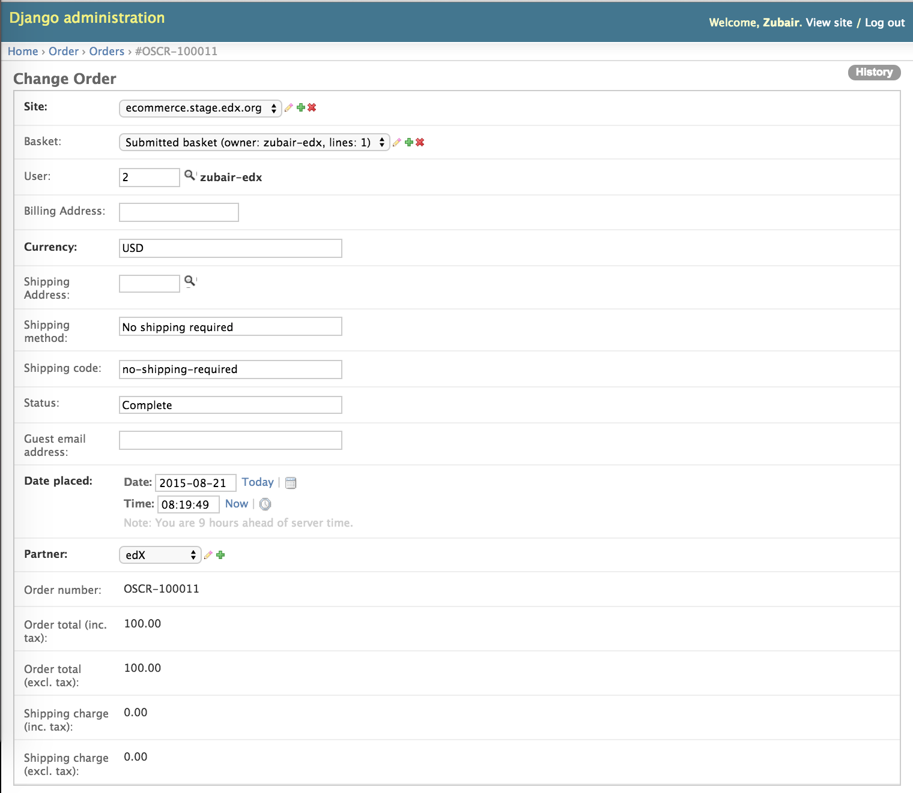

======================
Order Module
======================

This model is provided by the ``django-oscar``.
We have customized it in order to add a partner in it.

---------------------------------------------
Order Model | Django Admin
---------------------------------------------

The order object is automatically created when a user purchases a course from a partner.
To update the partner of an order, use the ``Order`` model in the `Django administration panel <http://localhost:8002/admin/order/order/>`_.
This panel is located at http://localhost:8002/admin/order/order/{order_id}/ ('order_id' is the id of the order).

The following image shows the ``Order`` model in the Django administration panel for an order against a specific partner.

